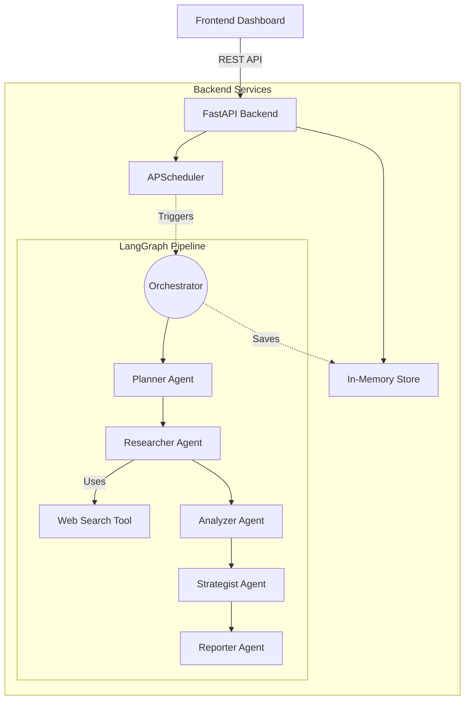

# EchoIntel - Agentic Competitive Intelligence

EchoIntel is a multi-agent system (Planner, Researcher, Analyzer, Strategist, Reporter) orchestrated via a LangGraph workflow to perform deep competitive intelligence research on any given company domain. It features a robust FastAPI backend with automated scheduled checks, structured logging, and a modern React + Vite dashboard powered by Tailwind CSS.

## Architecture



## Features
- Agentic Workflow: Specialized agents handling planning, web research, insights extraction, and strategic recommendations.
- Robust Tooling: Web search wrappers with graceful error handling and retry mechanisms.
- Full-Stack Application: A polished light-mode 'Oat & Emerald' UI built with Tailwind, consuming a rate-limited and resilient FastAPI service.
- Periodic Checks: Built-in APScheduler runs automatic background refresh jobs for tracked competitors.
- In-Memory Persistence: Extremely fast and simple in-memory data store for simplified deployment.

## Setup Instructions

### 1. Environment Variables
Create a `.env` file in the root directory:
```
GROQ_API_KEY=your_groq_api_key_here
SEARCH_API_KEY=your_search_api_key_here

# Optional: For email reporting functionality
SMTP_HOST=your_smtp_host
SMTP_PORT=587
SMTP_USER=your_smtp_user
SMTP_PASSWORD=your_smtp_password
```

### 2. Running with Docker Compose (Recommended)
You can easily spin up the full stack:
```bash
docker-compose up --build
```
- Frontend will be available at `http://localhost:80`
- API will be available at `http://localhost:8000`

### 3. Running Locally (Development)

**Backend:**
```bash
python -m venv venv
source venv/bin/activate
pip install -r requirements.txt
uvicorn app.main:app --reload
```

**Frontend:**
```bash
cd frontend
npm install
npm run dev
```
